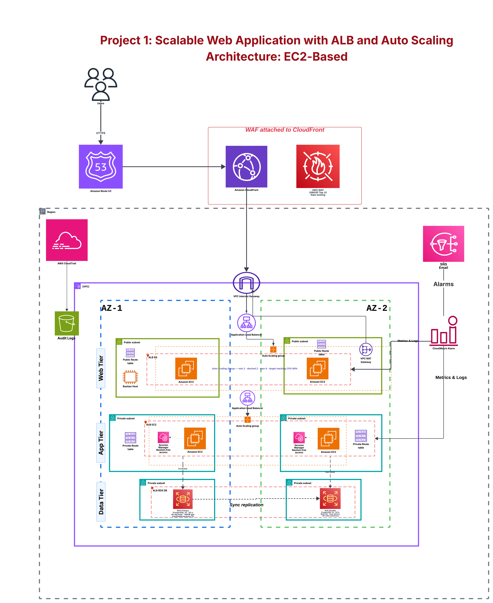

# Project 1: Scalable Web Application with ALB and Auto Scaling

> **Architecture:** EC2-Based • **Cloud:** AWS • **Availability:** Multi-AZ • **Pattern:** Three-Tier Architecture

## Overview

This project demonstrates a production-inspired, highly available web application architecture on AWS. The solution follows a **three-tier architecture** (Web, Application, and Database tiers) deployed across **two Availability Zones** for resilience.

The architecture includes:

- Route 53 for DNS
- CloudFront as CDN
- AWS WAF for edge protection
- Internet Gateway
- External Application Load Balancer
- Web Tier Auto Scaling Group
- Internal Application Load Balancer
- Application Tier Auto Scaling Group
- Amazon RDS Multi-AZ
- CloudTrail + S3 Audit Logs
- CloudWatch + SNS Monitoring
- Bastion Host and AWS Systems Manager Session Manager
- Single NAT Gateway (Lab/Cost-optimized design)

---

# Architecture



---

# Traffic Flow

```text
Users
   │
HTTPS
   │
Route 53
   │
CloudFront
   │
AWS WAF
   │
Internet Gateway
   │
External ALB
   │
Web Tier (ASG)
   │
Internal ALB
   │
Application Tier (ASG)
   │
Amazon RDS Primary
   │
Synchronous Replication
   │
Amazon RDS Standby
```

---

# Architecture Components

## Edge Layer

- Amazon Route 53
- Amazon CloudFront
- AWS WAF
- Internet Gateway

CloudFront caches content globally while AWS WAF protects against common attacks such as SQL Injection, XSS and rate limiting.

---

## Network Layer

- One VPC
- Two Availability Zones
- Public and Private Subnets
- Internet Gateway
- One NAT Gateway (cost-optimized lab deployment)

> **Note:** A single NAT Gateway is intentionally used to reduce lab cost. For production environments, one NAT Gateway per Availability Zone is recommended to eliminate a single point of failure.

---

## Web Tier

- External ALB
- EC2 Auto Scaling Group
- Bastion Host
- Public Subnets

Responsibilities:
- Accept user traffic
- Distribute requests
- Scale automatically

---

## Application Tier

- Internal ALB
- EC2 Auto Scaling Group
- Session Manager Access
- Private Subnets

Responsibilities:
- Business logic
- Private communication
- No direct internet access

---

## Database Tier

Amazon RDS Multi-AZ

- Primary DB
- Standby DB
- Automatic failover
- Synchronous replication
- Private subnet only

---

# Monitoring & Logging

CloudWatch collects metrics and logs.

SNS sends email alerts.

CloudTrail records AWS API activity and stores audit logs in Amazon S3.

---

# Security

## Network Security

- Security Groups
- Network ACLs
- Private Subnets
- Internal ALB

## Edge Security

- AWS WAF
- CloudFront
- HTTPS

## Access Security

- Bastion Host
- AWS Systems Manager Session Manager
- IAM Roles

## Database Security

- Private RDS
- Security Group restrictions
- Encryption in transit and at rest

---

# High Availability

- Multi-AZ deployment
- Auto Scaling Groups
- External and Internal ALBs
- Health Checks
- RDS Multi-AZ automatic failover

---

# Failure Scenario

If AZ-1 becomes unavailable:

- ALB routes traffic to healthy instances.
- Auto Scaling replaces failed instances.
- RDS fails over to the standby instance.
- Application continues serving users.

---

# AWS Services

| Service | Purpose |
|---------|---------|
| VPC | Network isolation |
| EC2 | Compute |
| Auto Scaling | Automatic scaling |
| ALB | Load balancing |
| Route53 | DNS |
| CloudFront | CDN |
| WAF | Edge protection |
| NAT Gateway | Outbound internet |
| Internet Gateway | Public connectivity |
| RDS Multi-AZ | Database HA |
| IAM | Identity |
| Systems Manager | Secure management |
| CloudWatch | Monitoring |
| SNS | Notifications |
| CloudTrail | Auditing |
| S3 | Audit log storage |

---

# Deployment Summary

1. Create VPC and subnets.
2. Attach Internet Gateway.
3. Create NAT Gateway.
4. Configure route tables.
5. Create Security Groups.
6. Launch Bastion Host.
7. Create Launch Templates.
8. Deploy Web Tier ASG.
9. Deploy Internal ALB.
10. Deploy App Tier ASG.
11. Deploy RDS Multi-AZ.
12. Configure Route53, CloudFront and WAF.
13. Configure CloudWatch, SNS and CloudTrail.

---

# Repository Structure

```text
.
├── diagrams/
│   └── architecture-diagram.png
├── screenshots/
├── scripts/
└── README.md
```

---

# Learning Outcomes

- VPC Design
- Multi-AZ Architecture
- Application Load Balancers
- Auto Scaling
- Private Networking
- Amazon RDS Multi-AZ
- CloudFront
- AWS WAF
- Monitoring with CloudWatch
- AWS Security Best Practices

---

# Future Improvements

- Terraform
- CI/CD Pipeline
- ECS or EKS
- Secrets Manager
- AWS Backup
- VPC Endpoints

---

# License

Educational project created as part of AWS learning and portfolio development.
